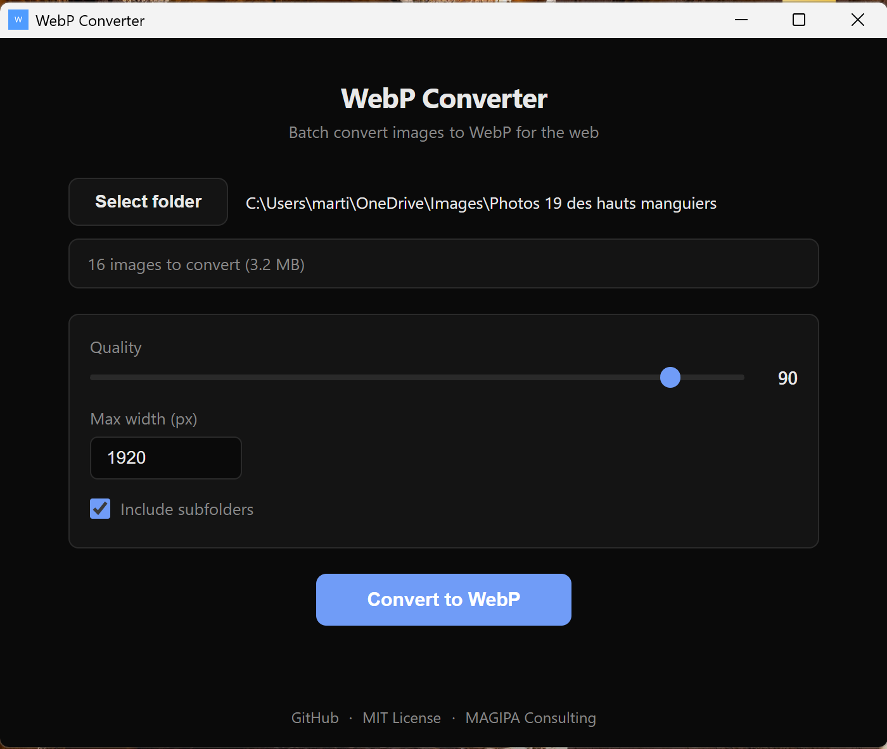

# WebP Converter

Convert all your images to WebP in one click. Drop a folder, hit convert, done.

**2 MB installer. No dependencies. No command line.**



## Download

**[Download for Windows (2 MB)](https://github.com/magipa-consulting/webp-converter/releases/latest)**

Download the `.exe` installer, run it, that's it.

## What it does

- Converts JPG, PNG, GIF, BMP, TIFF to WebP
- Resizes images to a max width (default 1920px, no upscale)
- Processes subfolders if you want
- Creates a `webp/` folder next to your originals — **never touches the originals**
- Shows you exactly how much space you saved

## Why WebP?

WebP images are **50-90% smaller** than JPG/PNG with similar quality. Your website loads faster, your storage costs drop.

## Settings

| Setting | Default | What it does |
|---------|---------|-------------|
| Quality | 80 | WebP quality (1-100). 80 is a good balance. |
| Max width | 1920px | Images wider than this get resized down. |
| Subfolders | On | Process images in all subfolders too. |

## Build from source

Requires [Rust](https://rustup.rs) and [Node.js](https://nodejs.org).

```
git clone https://github.com/magipa-consulting/webp-converter.git
cd webp-converter
npm install
npx tauri build
```

Installer will be in `src-tauri/target/release/bundle/`.

## License

MIT — do whatever you want with it.

Made by [MAGIPA Consulting](https://magipa.fr)
